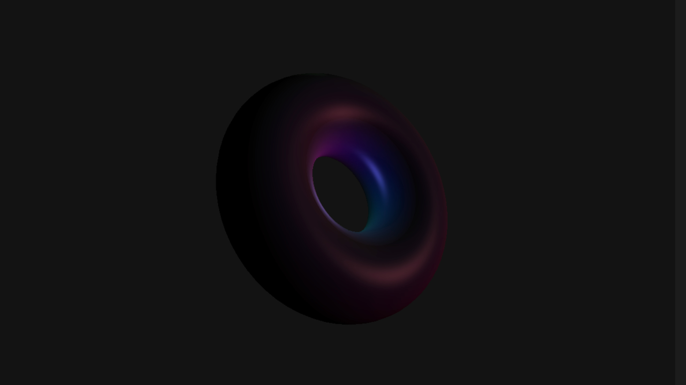

# dgel

[](https://www.npmjs.com/package/dgel)
[](https://www.npmjs.com/package/dgel)
[](https://www.npmjs.com/package/dgel)
[](https://github.com/dmnsgn/dgel/blob/main/package.json)
[](https://github.com/microsoft/TypeScript)
[](https://conventionalcommits.org)
[](https://github.com/prettier/prettier)
[](https://github.com/eslint/eslint)
[](https://github.com/dmnsgn/dgel/blob/main/LICENSE.md)

A WebGPU engine.

[](https://paypal.me/dmnsgn)
[](https://commerce.coinbase.com/checkout/56cbdf28-e323-48d8-9c98-7019e72c97f3)
[](https://twitter.com/dmnsgn)



## Installation

```bash
npm install dgel
```

## Usage

- Examples [demo](https://dmnsgn.github.io/dgel/) (you need a browser supporting WebGPU, most likely to work in Chrome Canary)
- Examples [source](examples/)
- [API Docs](https://dmnsgn.github.io/dgel/docs/)

## License

MIT. See [license file](https://github.com/dmnsgn/dgel/blob/main/LICENSE.md).
